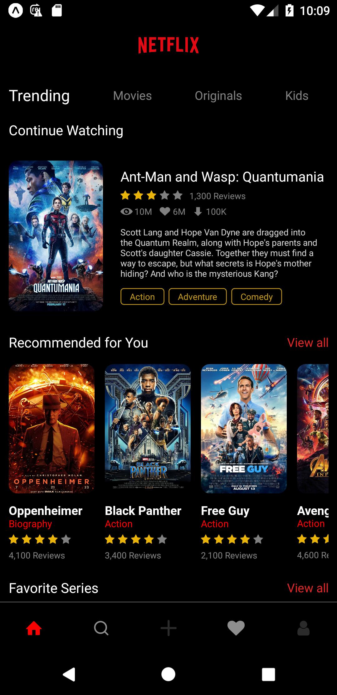
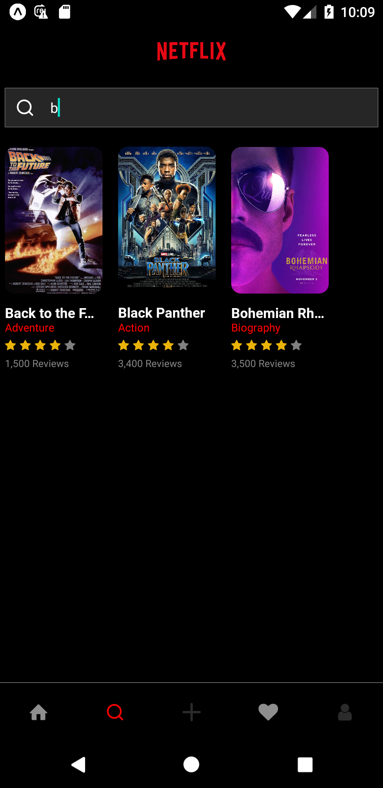
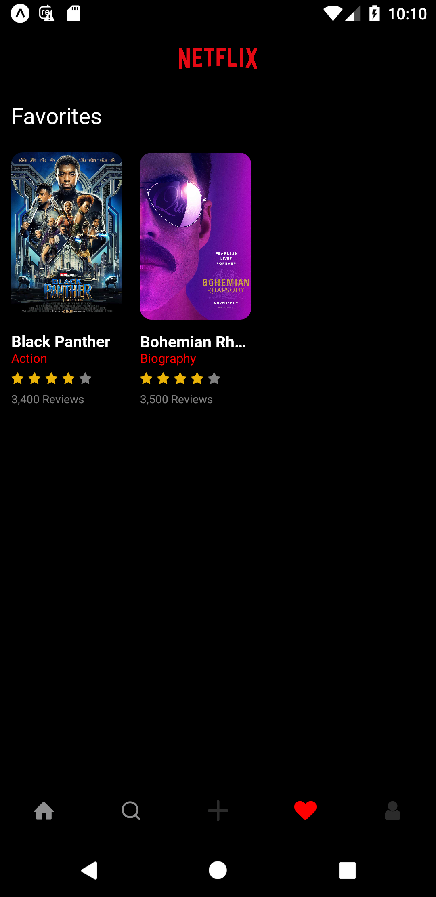
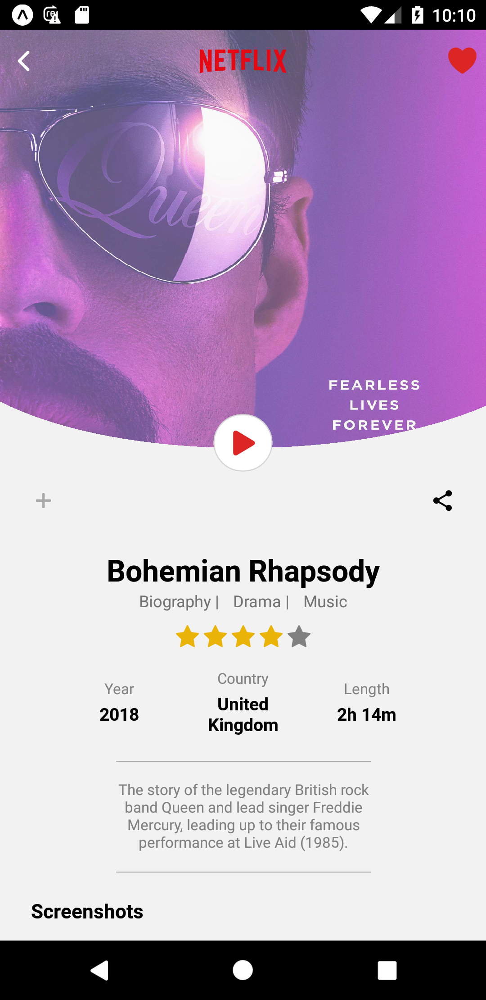
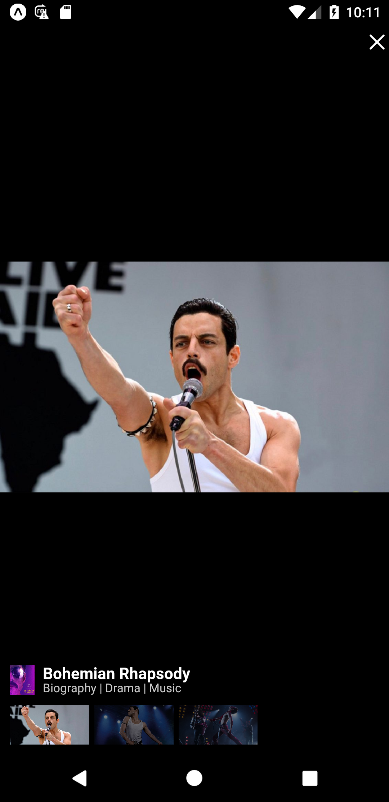
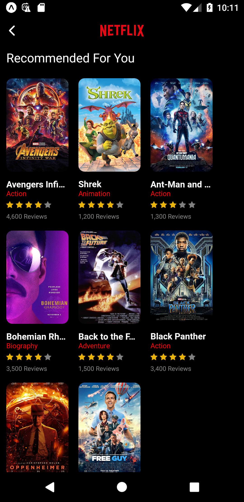

# Netflix Clone (react native app)
This project is mobile cross-platform application based on netflix developed by **[React Native](https://reactnative.dev/)** library and **[Typescript](https://www.typescriptlang.org/)** language. The application replicates a basic app functionality without advanced playback features. This project is created based on design on [dribble platform](https://dribbble.com/shots/10070781-Netflix-Mobile-App-Redesign/attachments/2088191?mode=media).

**Tags:** [React Native](https://reactnative.dev/), [Typescript](https://www.typescriptlang.org/)

## Motivation
This project serves for learning purposes and to present my skills with **React** and **Typescript**.

## Features
- main screens divided to tabs
- data loaded from local JSON
- categories with horizontal scrolls
- managing favorites (reseting after application is closed)
- each movie has own details page with screenshot gallery

## What I have learned
- folder based routing
- custom hooks
- async storage
- refs and imperative handles for controlling components
- svg paths

## Configuration
This is [Node.js](https://nodejs.org/en) project, so before installing [download and install latest Node.js](https://nodejs.org/en/download/current). After installation you can install project dependencie with command:
```bash
npm install
```
After installing dependencies you can start application with command:
```bash
npx expo
```

## Preview
<br />
## Screenshots





